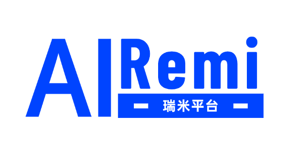
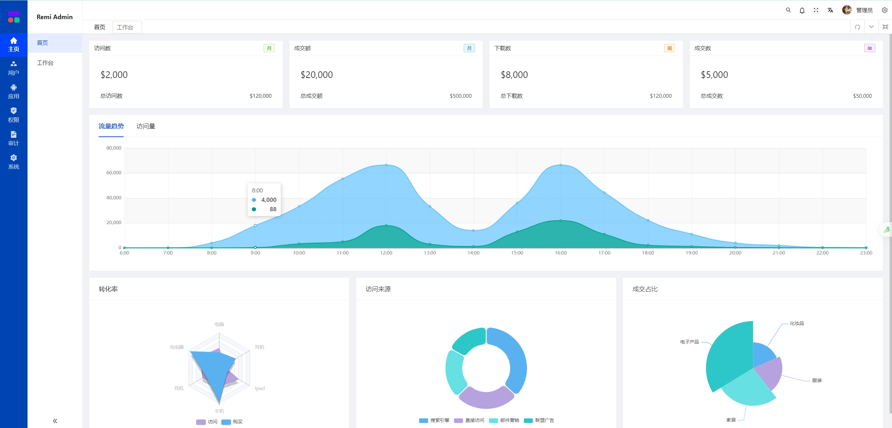

 

## 瑞米平台

### 项目概述

Remi Cloud (瑞米) 是一款企业级AI+微服务架构的快速开发平台，是采用领域驱动模型(DDD)设计思想的、遵循SpringCloudAlibaba编程思想，高度模块化和可配置化。具备服务发现、配置、熔断、限流、降级、监控、分布式事务、单点登录、统一身份，统一应用、统一权限、AI搜索等功能。基于[Apache 2.0](https://www.apache.org/licenses/LICENSE-2.0)协议，毫无保留给个人及企业免费使用，由[江苏点九科技有限公司](https://dianjiu.cc)提供技术支持。

------

<h3> 您的 ⭐️  Star ⭐️  是对瑞米开源团队的最大肯定。</h3>

------

### 设计理念

瑞米平台的设计理念：**所见即所得，极简且易用**。 我相信大家在使用过程中能体验到设计师的用心之处，**颜色的高对比度**、**左侧菜单的设计**、**减少了弹框的嵌套**、**三等分的抽屉使用**等，让用户体验更加友好。

<h3> 关注微信公众号，了解最新动态：</h3>

### 项目规划
瑞米平台目前还在公测阶段，可能会些许不足，也请您给些包容并及时反馈给我们，24年年底我们定会按时交出让您满意的瑞米快速开发平台。

### 体验地址

[https://remi.run](https://remi.run)

RemiAdmin/123456

### 官方文档
请访问[语雀空间公开页](https://remi.yuque.com/r/organizations/homepage)
- [更新日志](https://remi.yuque.com/gvwcfc/dvpw89)
- [使用手册](https://remi.yuque.com/gvwcfc/vwwd5c)
- [操作视频](https://remi.yuque.com/gvwcfc/video) （正在抓紧更新，敬请期待）

## 功能介绍

### 统一门户（Remi UPM）
瑞米统一门户引擎是一种集成了多种应用和服务的综合性管理平台，旨在为企业和组织提供一个统一的信息管理和访问入口。这种平台通过整合多种系统和服务，实现了信息的集中展示和管理，提高了工作效率和用户体验。
- 待办已办：集成了各种常用功能，如：待办、已办、流程、我的、我的申请、我的审批等。
- 智能搜索：支持全局的功能菜单、业务数据的搜索；支持AI在线问答。
- 快捷导航：用户可以根据自己的需求选择不同的角色视图进行工作。
- 我的应用：在工作台中动态加载当前登录用户可操作的应用.如：HRM、CRM、CMS等。
- 统计页面：可根据具体业务需求开发具体的统计分组。
- 千人千面：支持不同用户展示不同的主题、工作台、列表字段和分页数等。

<table>
    <tr>
        <td></td>
        <td></td>
    </tr>
</table>

### 登录引擎（Remi SSO）

瑞米统一登录引擎是一种用于集中管理和简化用户访问多个应用系统时的身份验证流程的技术方案。它为用户提供了一个统一的入口，使得用户只需要一次登录操作即可访问所有已经授权的应用系统，而不需要在每个系统中单独进行身份验证。

- 单点登录：用户只需登录一次即可访问所有相关联的应用程序。
- 身份验证：支持多种身份验证方式，包括但不限于密码、验证码等。
- 身份管理：支持用户注册、修改密码、找回密码、修改个人信息等。
- 系统集成：能够与多种不同的系统和技术栈集成，提供无缝的用户体验。
- 可扩展性：随着业务的发展，平台能够轻松扩展以适应更多的用户和应用。
- 多种协议：支持OAuth2.x、OIDC、SAML2.0、JWT、CAS等SSO标准协议。
- 跨域共享：支持跨域的资源共享和身份验证，不同域名下的资源也能实现无缝访问。

<table>
	<tr>
        <td></td>
        <td></td>
    </tr>
</table>

### 应用引擎（Remi AMS）
瑞米统一应用引擎是是一种高级的企业级解决方案，旨在简化并优化企业内部的IT架构，通过整合多个分散的应用程序和服务，提供一个统一的管理平台。

- 统一界面：提供单一入口点，用户可以通过统一的界面访问和操作所有关联的业务应用，无需切换多个系统，提高用户体验。
- 快速集成：无缝集成现有的各种异构系统和应用程序，无论是内部部署还是云端服务，保证数据的一致性和完整性。
- 应用集成：统一管理各种业务应用系统，如：HRM、CRM、CMS等。
- 应用配置：每个业务系统的全局配置，如：邮件配置、存储配置等。
- 应用安全：配置每个业务系统的授权协议、家解密方式等。
- 应用菜单：配置业务系统的目录菜单，操作按钮的权限标识。
- 应用组织：给每个业务系统分配业务组织，配置业务系统的用户。
- 应用分组：支持会员用户根据实际业务需求，进行应用分组。

<table>
	<tr>
        <td></td>
        <td></td>
    </tr>
</table>

### 身份引擎（Remi IDM）
瑞米统一身份引擎是一种集中化管理用户身份、认证、授权和审计信息的平台。它是现代企业IT架构中不可或缺的一部分，尤其是在多系统、多应用的环境下，其作用尤为显著。

- 公司管理：配置基准组织-机构（集团公司、分/子公司、办事处等），以树结构展现。
- 部门管理：配置基准组织-部门（部门、小组、团队等），以树结构展现。 
- 用户管理：用户是系统操作者，该功能主要完成基准组织的用户配置。 
- 业务组织：配置业务组织，如：部门、项目、团队等。
- 职位职级：配置系统用户所属担任职务。

<table> 
	<tr>
        <td></td>
        <td></td>
    </tr>
    <tr>
        <td></td>
        <td></td>
    </tr>
</table>

### 权限引擎（Remi PMS）
瑞米统一权限引擎是一种企业级解决方案，旨在通过提供一个集中的解决方案来管理组织内部的用户权限和访问控制，不仅提高了安全性，还简化了管理流程，增强了用户体验，并有助于满足合规要求。对于那些寻求提高数据安全性和管理效率的企业来说，瑞米统一权限管理平台是一个不可或缺的工具。

- 角色管理：定义和管理用户角色，角色代表了一组预定义的权限集合。
- 身份管理：基于瑞米身份引擎实现集中管理用户的身份信息，包括身份验证、身份更新等。
- 权限分配：根据用户的角色和职责，分配相应的权限，确保用户只能访问其被授权的资源。
- 菜单权限：完善的策略管理，如基于属性的ABAC或基于角色的RBAC。
- 数据权限：完善的权限控制，如数据行权限以及数据列权限配置和鉴权。
- 访问控制：实施细粒度的访问控制策略，确保只有经过验证和授权的用户才能访问特定资源。
- 审计监控：记录用户的访问行为，提供详细的审计日志，帮助组织监控权限使用情况并满足合规要求。

<table>
	<tr>
        <td></td>
        <td></td>
    </tr>
    <tr>
        <td></td>
        <td></td>
    </tr>
</table>

### 代码引擎（Remi LCE）

- 多数据库：支持数据库有MySQL，PostgreSQL，SQLServer，Oracle等。
- 数据库表：动态连接数据源、数据库，读取数据表信息。
- 代码生成： 内置Java、Vue、TS等，可自行扩展对其他语言的支持。
- 模板管理：支持基于Velocity的代码生成模板配置，内置Remi模板。
- 数据类型：支持数据类型在不同数据库下表现为不同数据库类型的方言。
- 分组管理：支持对模板、数据源等信息的自定义分组管理。
- 版本管理： 实现数据表的版本管理，可生成增量DDL脚本。
- 数据字典： 代码映射管理，实现数据字典与数据表字段的关联。
- ER关系图： 基于数据表可绘制ER关系图，也支持概念模型等抽像设计。

### 资源中心（Remi FRC）

- 上传下载：支持MinIO、S3、OSS、COS、七牛云等多种存储方式。
- 文件管理：支持类网盘的界面展示，支持文件自定义分组。
- 文件浏览：用户可以浏览存储在云端的文件和文件夹。
- 文件操作：支持文件的重命名、移动、复制、删除等操作。
- 文件分享：用户可以生成文件的分享链接，供他人访问。
- 文件搜索：支持按照文件类型、大小、上传时间等条件进行过滤搜索。
- 文件权限：设置文件的访问权限，如私有、公开、只读等。
- 版本控制：保存文件的不同版本，方便用户回溯历史版本。
- 数据加密：上传和下载过程中对文件进行加密，保护数据安全。
- 使用统计：提供文件使用情况的统计报表。分析用户行为，优化产品体验。

### 审计监控（Remi ALM）

- 在线用户：当前系统中活跃用户状态监控，支持批量强退。
- 审计监控：记录用户的访问行为，监控权限使用情况并满足合规要求。
- 登录日志：系统登录日志记录查询包含登录异常。
- 操作日志：系统正常操作日志记录和查询。
- 异常日志：系统异常信息日志记录和查询。
- 链路日志：基于traceId查询接口调用链路。
- 服务监控：监视当前系统CPU、内存、磁盘、堆栈等相关信息。
- 缓存监控：监视Redis服务的运行模式、内存信息、客户端数量。

<table>
	<tr>
        <td></td>
        <td></td>
    </tr>
    <tr>
        <td></td>
        <td></td>
    </tr>
</table>

### 系统管理（Remi SYS）

- 字典管理：对系统中经常使用的一些较为固定的数据进行维护。
- 参数管理：对系统动态配置常用参数。
- 通知公告：系统通知公告信息发布维护。
- 基础表单：用于提交表单时使用，可创建表单和自定义字段。
- 导入导出：可以根据不同的应用场景进行数据迁移、备份、恢复。
- 布局设置：支持导航模式、系统主题、顶栏主题、菜单主题等设置。
- 邮件通知：支持邮件配置、模板分组、模板配置、表单关联等设置。
- 多语言支持：支持中英文界面切换、中英文字段描述、多语言异常提示。

## 反馈建议
如果您对我们的产品或服务有任何疑问或需要帮助，欢迎添加我们的微信客服号。我们会在第一时间为您解答。此外，我们的微信群是一个活跃的社区，您可以在那里与其他用户交流经验，分享心得，获取最新的产品信息和版本通知。
<table>
	<tr>
        <td></td>
        <td></td>
        <td></td>
    </tr>
</table>

